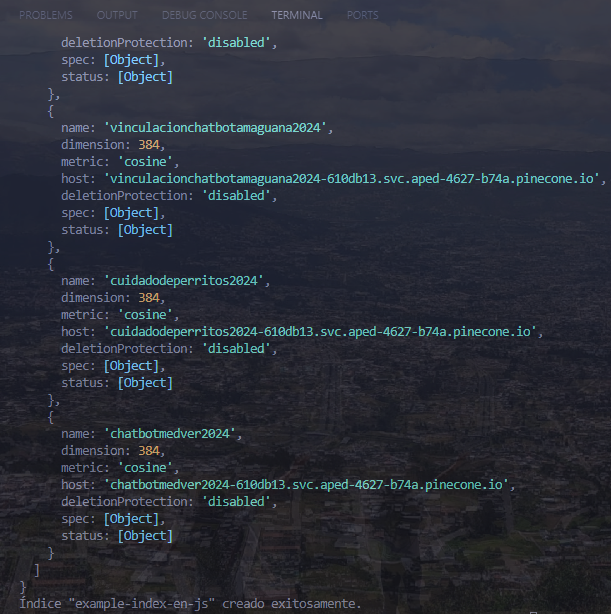
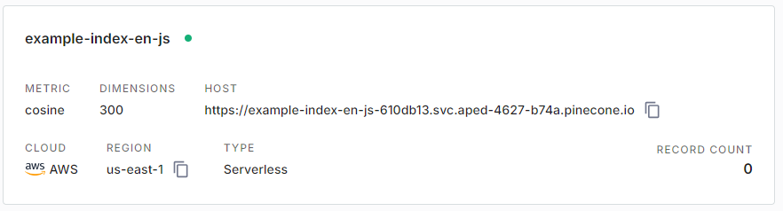

## Instalar Pinecone
npm install @pinecone-database/pinecone

## Instalar mammoth (Para el Documento de Word las inscrustaciones)
npm install mammoth

**Información:** https://docs.pinecone.io/guides/get-started/quickstart

## Creado el Index en Pinecone

Este es un proyecto increíble que hace cosas increíbles.

## Ir a la documentacion npm Hugging Face
**Información:** 
- npm i @huggingface/transformers
- npm i @huggingface/transformers